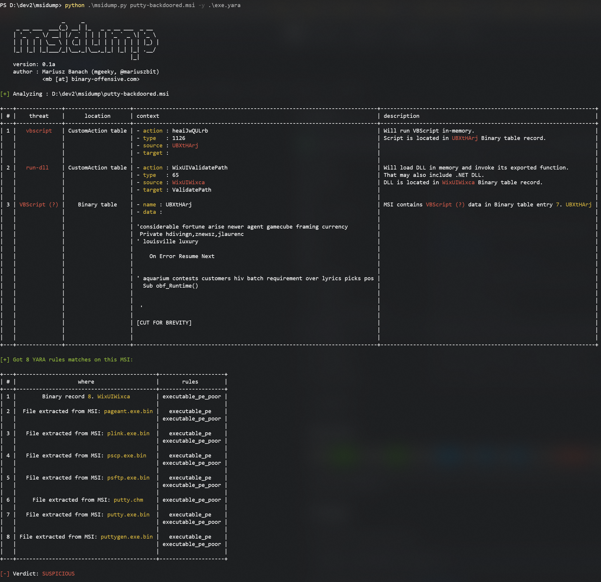
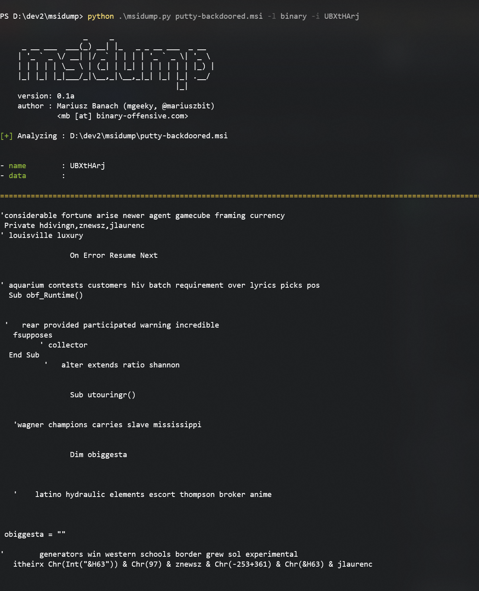
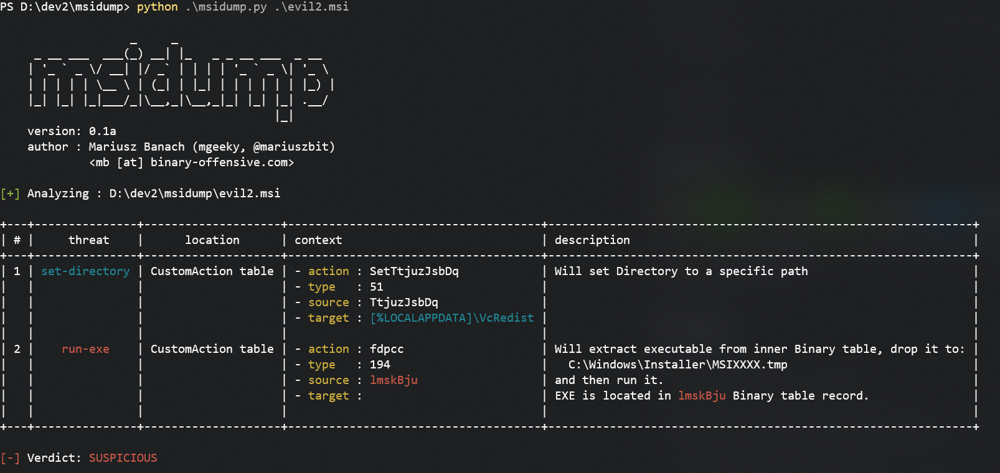
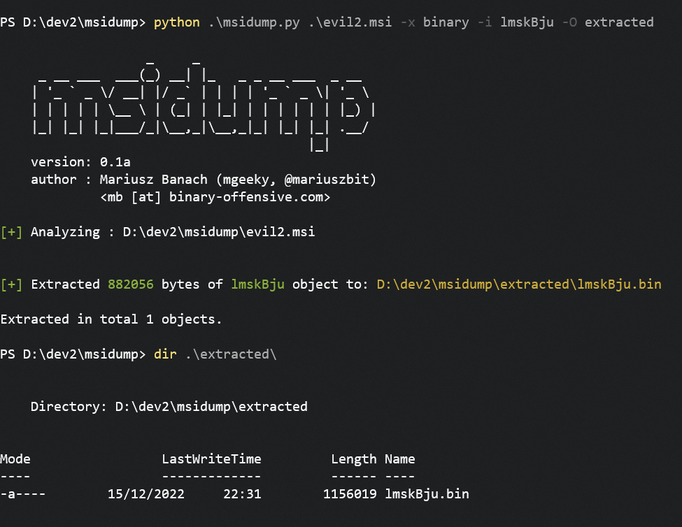

# Notes
Use Python <3.12 (otherwise you need C++ dev tools which are about 7GB...)

# `msidump`

**MSI Dump** - a tool that analyzes malicious MSI installation packages, extracts files, streams, binary data and incorporates YARA scanner.

On Macro-enabled Office documents we can quickly use [oletools mraptor](https://github.com/decalage2/oletools/blob/master/oletools/mraptor.py) to determine whether document is malicious. If we want to dissect it further, we could bring in [oletools olevba](https://github.com/decalage2/oletools/blob/master/oletools/olevba.py) or [oledump](https://github.com/DidierStevens/DidierStevensSuite/blob/master/oledump.py).

To dissect malicious MSI files, so far we had only one, but reliable and trustworthy [lessmsi](https://github.com/activescott/lessmsi).
However, `lessmsi` doesn't implement features I was looking for:

- quick triage
- Binary data extraction
- YARA scanning

Hence this is where `msidump` comes into play.


## Features

This tool helps in quick triages as well as detailed examinations of malicious MSIs corpora.
It lets us:

- Quickly determine whether file is suspicious or not.
- List all MSI tables as well as dump specific records
- Extract Binary data, all files from CABs, scripts from CustomActions
- scan all inner data and records with YARA rules
- Uses `file`/MIME type deduction to determine inner data type

It was created as a companion tool to the blog post I released here:

- [MSI Shenanigans. Part 1 - Offensive Capabilities Overview](https://mgeeky.tech/msi-shenanigans-part-1/)


### Limitations

- The program is still in an early alpha version, things are expected to break and triaging/parsing logic to change
- Due to this tool heavy relience on Win32 COM `WindowsInstaller.Installer` interfaces, currently **it is not possible to support native Linux** platforms. Maybe `wine python msidump.py` could help, but haven't tried that yet.


## Use Cases

1. Perform quick triage of a suspicious MSI augmented with YARA rule:

```
cmd> python msidump.py evil.msi -y rules.yara
```



Here we can see that input MSI is injected with suspicious **VBScript** and contains numerous executables in it.


2. Now we want to take a closer look at this VBScript by extracting only that record. 

We see from the triage table that it was present in `Binary` table. Lets get him:

```
python msidump.py putty-backdoored.msi -l binary -i UBXtHArj
```

We can specify which to record dump either by its name/ID or its index number (here that would be 7).



Lets have a look at another example. This time there is executable stored in `Binary` table that will be executed during installation:



To extract that file we're gonna go with 

```
python msidump.py evil2.msi -x binary -i lmskBju -O extracted
```

Where 
- `-x binary` tells to extract contents of `Binary` table
- `-i lmskBju` specifies which record exactly to extract
- `-O extracted` sets output directory




For the best output experience, run the tool on a **maximized console window** or redirect output to file:

```
python msidump.py [...] -o analysis.log
```

## Full Usage

```
PS D:\> python .\msidump.py --help
options:
  -h, --help            show this help message and exit

Required arguments:
  infile                Input MSI file (or directory) for analysis.

Options:
  -q, --quiet           Surpress banner and unnecessary information. In triage mode, will display only verdict.
  -v, --verbose         Verbose mode.
  -d, --debug           Debug mode.
  -N, --nocolor         Dont use colors in text output.
  -n PRINT_LEN, --print-len PRINT_LEN
                        When previewing data - how many bytes to include in preview/hexdump. Default: 128
  -f {text,json,csv}, --format {text,json,csv}
                        Output format: text, json, csv. Default: text
  -o path, --outfile path
                        Redirect program output to this file.
  -m, --mime            When sniffing inner data type, report MIME types

Analysis Modes:
  -l what, --list what  List specific table contents. See help message to learn what can be listed.
  -x what, --extract what
                        Extract data from MSI. For what can be extracted, refer to help message.

Analysis Specific options:
  -i number|name, --record number|name
                        Can be a number or name. In --list mode, specifies which record to dump/display entirely. In --extract mode dumps only this particular record to --outdir
  -O path, --outdir path
                        When --extract mode is used, specifies output location where to extract data.
  -y path, --yara path  Path to YARA rule/directory with rules. YARA will be matched against Binary data, streams and inner files

------------------------------------------------------

- What can be listed:
    --list CustomAction     - Specific table
    --list Registry,File    - List multiple tables
    --list stats            - Print MSI database statistics
    --list all              - All tables and their contents
    --list olestream        - Prints all OLE streams & storages.
                              To display CABs embedded in MSI try: --list _Streams
    --list cabs             - Lists embedded CAB files
    --list binary           - Lists binary data embedded in MSI for its own purposes.
                              That typically includes EXEs, DLLs, VBS/JS scripts, etc

- What can be extracted:
    --extract all           - Extracts Binary data, all files from CABs, scripts from CustomActions
    --extract binary        - Extracts Binary data
    --extract files         - Extracts files
    --extract cabs          - Extracts cabinets
    --extract scripts       - Extracts scripts

------------------------------------------------------
```

## TODO

- Triaging logic is still a bit flakey, I'm not very proud of it. Hence it will be subject for constant redesigns and further ramifications
- Test it on a wider test samples corpora
- Add support for input ZIP archives with passwords
- Add support for ingesting entire directory full of YARA rules instead of working with a single file only
- Currently, the tool matches malicious `CustomAction Type`s based on assessing their numbers, which is prone to being evaded.
  - It needs to be reworked to properly consume Type number and decompose it [onto flags](https://learn.microsoft.com/en-us/windows/win32/msi/summary-list-of-all-custom-action-types)


## Tool's Name

Apparently when naming my tool, I didn't think on checking whether it was already taken.
There is another tool named `msidump` being part of [msitools](https://gitlab.gnome.org/GNOME/msitools) GNU package:

- [msidump](https://wiki.gnome.org/msitools)

---

### ☕ Show Support ☕

This and other projects are outcome of sleepless nights and **plenty of hard work**. If you like what I do and appreciate that I always give back to the community,
[Consider buying me a coffee](https://github.com/sponsors/mgeeky) _(or better a beer)_ just to say thank you! 💪 

---

```
Mariusz Banach / mgeeky, (@mariuszbit)
<mb [at] binary-offensive.com>
```
